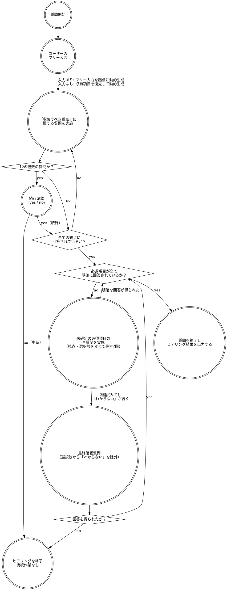

# ヒアリングスキル

## 概要

Web開発の案出しに必要な情報をユーザーからヒアリングする。
ヒアリング完了後、収集した情報を構造化してまとめる。

## ヒアリングフロー

下記のフローに忠実に従うこと。勝手な判断は行わないこと。



## フロー補足

### ユーザーのフリー入力

以下のメッセージを表示してユーザーの入力を受け付ける。

```
💡 Web開発の案出しを始めましょう。

どんな開発をしたいか、思っていることを自由に教えてください。
何もなければ 「スキップ」 と入力してスキップしてください。
※目的や方向性を入力するだけで、出力される開発案の精度が向上します。

>
```

入力なしの定義：「スキップ」と入力 / 空白のみの入力 / なしの旨の入力

### 「収集すべき観点」に関する質問を実施

各質問は必ず **2〜4択の選択肢** として提示する。選択肢以外のフリー入力も許容する。

```
質問 N
{質問文}
※選択肢に希望の回答が存在しない場合、フリー入力で回答してください。

1. {選択肢A}
2. {選択肢B}
3. {選択肢C}
4. わからない / まだ決めていない

>
```

質問はコンテキストに応じて動的に生成する（固定リストではない）。

### 続行確認（10の倍数の質問到達時）

10の倍数の質問への回答が完了した直後に以下を実施する。

- 残りの未確定の必須項目と未ヒアリングの任意項目をユーザーに共有する
- 以下を提示する
  ```
  質問を続けますか？
  1. yes（続行）
  2. no（終了）
  ```
  - yes → 次の質問へ進む
  - no → ヒアリングを終了し、後続の作業を一切行わない

### 未確定の必須項目の再質問（最大2回）

「わからない / まだ決めていない」が回答された場合、視点や選択肢を変えて同じ観点を再質問する。

- 言い換えの例：「なぜその課題が起きているか」→「今どんな手順で行っているか」→「困っている具体的な場面は？」
- 任意項目の場合は再質問を1回のみ行い、それでも「わからない」なら未確定として次へ進む

### 最終確認質問

必須項目に対して2回の再質問でも「わからない / まだ決めていない」が続いた場合、最後に1回だけ以下の形式で質問する。

- 選択肢から「わからない / まだ決めていない」を除外する
- 「この観点が不明なままでは開発案を作成できないため、回答いただけない場合はヒアリングを終了します」と伝える

### 質問を終了しヒアリング結果を出力する

「ヒアリングを完了します。」と表示した後、以下のフォーマットで出力する。

```
## ヒアリング結果

### 基本情報

開発の目的・背景: {内容}
解決したい課題・ペインポイント: {内容}
想定する利用シーン: {内容}

### ユーザー・市場

ターゲットユーザー: {内容}
提供形態: {BtoC / BtoB / 社内ツール / その他（内容）}
競合・類似サービス: {内容 or "特になし"}
差別化したいポイント: {内容 or "未定"}

### 機能・技術

実現したい主要機能（優先順）: {内容}
技術スタックの希望: {内容 or "特になし"}
外部サービス連携: {内容 or "なし"}
認証・セキュリティ要件: {内容 or "特になし"}

### リソース・制約

開発体制・人数: {内容 or "未定"}
開発期間の目安: {内容 or "未定"}
運用・インフラコスト上限: {内容 or "未定"}

### 補足

その他・特記事項: {内容 or "なし"}
```

このまとめを後続の案生成フェーズに引き渡す。

## 収集すべき観点

### 必須項目

| 観点 | 例 |
|------|----|
| 開発の目的・背景 | 業務効率化、新規サービス立ち上げ |
| ターゲットユーザー・提供形態 | 一般消費者(BtoC)、社内スタッフ(社内ツール)、特定業種(BtoB) |
| 解決したい課題・ペインポイント | 手作業が多い、情報が分散している |
| 実現したい主要機能 | タスク管理、通知機能、CSV出力 |

### 任意項目

| 観点 | 例 |
|------|----|
| 競合・類似サービスと差別化ポイント | Notionより軽量にしたい、特定業種に特化したい |
| 技術スタックの希望・制約 | 既存システムとの連携必須、Reactを使いたい |
| 開発体制・期間の見込み | 1人・3ヶ月、チーム3人・半年 |
| 外部サービス連携・認証要件 | Slack通知、Google認証、社内LDAPと連携 |
| 運用・コスト面の制約 | 月額予算の上限、運用担当者の有無 |
