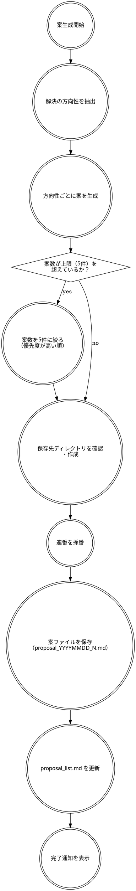

# 案生成スキル

## 概要

`skill-kernel:hearing` のヒアリング結果と `skill-kernel:research` の情報収集結果を受け取り、Web開発案を生成・保存する。

## 案生成フロー

下記のフローに忠実に従うこと。勝手な判断は行わないこと。



## フロー補足

### 解決の方向性を抽出

ヒアリング結果と情報収集結果から、解決の方向性を列挙する。

- 方向性とは「同じ課題領域の中で、解決アプローチ・コンセプトが異なる別プロダクトのアイデア」のこと
  - 例：SNSサポート系という括りなら「AI自動生成アプリ」「スケジューリングアプリ」など
- 方向性が1つに絞られていれば1案、複数あれば複数案を生成する
- 情報収集結果の競合・ユーザーペイン・市場トレンドを参照して、差別化できる方向性を優先する

### 方向性ごとに案を生成

各方向性に対して、以下のフォーマットで案を生成する。

````markdown
---
id: proposal_YYYYMMDD_N
title: "アプリケーションタイトル"
target_users: "ターゲットユーザーの説明"
scale: small | medium | large
estimated_cost: "月額 ¥X,XXX 〜 ¥XX,XXX 程度"
stack:
  frontend: []
  backend: []
  infrastructure: []
  database: []
created_at: "YYYY-MM-DD"
---

## 概要

（2〜3行でプロダクトの概要を記述）

## ターゲットユーザー

（ターゲットの詳細説明）

## 主要機能

- 機能1
- 機能2
- 機能3

## 推奨技術スタック

（技術選定の理由も含めて記述）

## 開発規模感

{small/medium/large}：（規模感の補足説明）

| 規模 | 目安 |
|------|------|
| small | 1人・1〜2ヶ月 |
| medium | 2〜4人・3〜6ヶ月 |
| large | 5人以上・半年〜1年以上 |

## 運用コスト見積もり

（月額概算と主なコスト要因）

## 提案理由

（ヒアリング回答と情報収集結果を踏まえ、なぜこの案を提案するかのサマリー）
````

### 案数を5件に絞る（優先度が高い順）

方向性が6つ以上になった場合、以下の基準で優先度を判定して上位5件に絞る。

- ユーザーペインへの解決度が高い
- 競合との差別化が明確
- ヒアリング結果との合致度が高い

### 保存先ディレクトリを確認・作成

```bash
mkdir -p sk-docs/proposal
```

### 連番を採番

1. `sk-docs/proposal/proposal_list.md` が存在する場合、当日（YYYYMMDD）の最大連番 N を読み取る
2. 存在しない場合は N = 0 とする
3. 各案を N+1, N+2, ... と採番する

```bash
ls sk-docs/proposal/proposal_YYYYMMDD_*.md 2>/dev/null | wc -l
```

### 案ファイルを保存（proposal_YYYYMMDD_N.md）

ファイル名：`sk-docs/proposal/proposal_YYYYMMDD_N.md`

### proposal_list.md を更新

`sk-docs/proposal/proposal_list.md` を以下の形式で更新する（なければ新規作成、あれば行を追記）。

```markdown
# 開発案リスト

| ID | タイトル | ターゲット | 規模 | 作成日 | ファイル |
|----|----------|------------|------|--------|----------|
| proposal_20250429_1 | タイトルA | ターゲットA | small | 2025-04-29 | [📄](./proposal_20250429_1.md) |
```

### 完了通知を表示

```
✅ 開発案の生成・保存が完了しました！

━━━━━━━━━━━━━━━━━━━━━━━━━━━━━━
📁 保存した案：

  1. sk-docs/proposal/proposal_YYYYMMDD_1.md
     「{タイトル1}」（{規模}）

  2. sk-docs/proposal/proposal_YYYYMMDD_2.md
     「{タイトル2}」（{規模}）

📋 一覧：sk-docs/proposal/proposal_list.md
━━━━━━━━━━━━━━━━━━━━━━━━━━━━━━

気に入った案のファイルを開いてコーディングを始めましょう！
```
