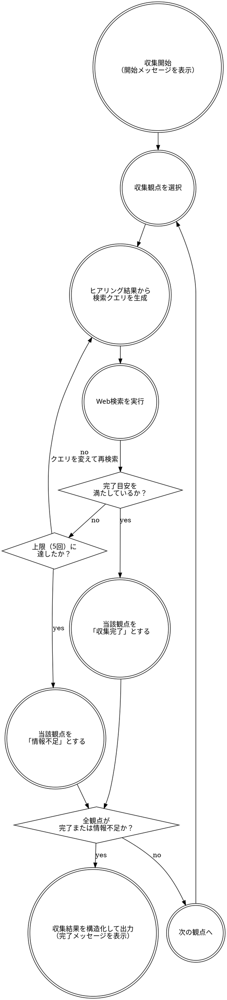

# 情報収集スキル

## 概要

`skill-kernel:hearing` のヒアリング結果を受け取り、Web検索で情報を収集する。
収集結果を構造化して案生成スキルへ引き渡す。ユーザーへの出力は進捗通知のみ。

## 情報収集フロー

下記のフローに忠実に従うこと。勝手な判断は行わないこと。



## フロー補足

### 収集開始（開始メッセージを表示）

以下のメッセージをユーザーに表示する。

```
🔍 案を作成するための情報収集を開始します。
情報収集中...
```

### 収集観点を選択

以下の優先順に観点を処理する。技術スタックの希望がヒアリング結果にない場合は観点4をスキップする。

| 順番 | 観点 | 完了目安 |
|------|------|---------|
| 1 | 競合・類似サービス（機能・料金・強弱） | 主要競合3件以上の情報が揃っている |
| 2 | 市場規模・ユーザーニーズのトレンド | 対象市場の規模感と直近トレンドが把握できている |
| 3 | ユーザーのペイン（SNS・App Storeレビュー） | 実際のユーザー不満が3件以上把握できている |
| 4 | 技術スタック（希望がある場合のみ） | 採用事例と既知課題が把握できている |
| 5 | 規制・法的リスク | 主要な制約が把握できている（該当なしも可） |

### ヒアリング結果から検索クエリを生成

- ヒアリング結果のキーワード（目的・ターゲット・課題・主要機能）を組み合わせてクエリを生成する
- 前回の検索で情報が不足していた場合は、視点・言語（日英）・キーワードを変えたクエリを生成する

#### 観点3（ユーザーのペイン）のクエリ指針

ユーザーの生の声が含まれるUGC系ソースを優先してクエリを組み立てる。以下の順で試みる。

| 優先度 | ソース | クエリ例 |
|--------|--------|---------|
| 高 | Reddit | `site:reddit.com {サービス名} complaints OR frustrating OR "wish it had"` |
| 高 | X（Twitter） | `{サービス名} 不満 OR 使いにくい OR 欲しい機能` |
| 高 | App Store / Google Play | `{サービス名} レビュー 不満 OR 改善 OR "使いにくい"` |
| 中 | Yahoo!知恵袋 | `site:chiebukuro.yahoo.co.jp {課題キーワード}` |
| 低 | 専門記事・アンケート | `{市場キーワード} ユーザー課題 OR ペイン OR 不満 調査` |

### 完了目安を満たしているか？

各観点の「完了目安」（上表）を満たしているかを判定する。満たしていない場合は追加検索を行う。

### 上限（5回）に達したか？

1観点あたりの検索回数が5回に達した場合、それ以上の検索は行わず「情報不足」として次の観点へ進む。

### 収集結果を構造化して出力（完了メッセージを表示）

以下のメッセージをユーザーに表示する。

```
✅ 情報収集完了
```

その後、以下のフォーマットで収集結果を出力し、案生成スキルへ引き渡す。

```
## 情報収集結果

### 競合・類似サービス

{競合サービス名・機能・料金・強み・弱みの一覧}

### 市場規模・トレンド

{対象市場の規模感・直近のトレンド}

### ユーザーのペイン

{SNS・レビューから収集した実際のユーザー不満・要望}

### 技術スタック

{採用事例・既知課題}（希望がない場合は「ヒアリングで希望なし」と記載）

### 規制・法的リスク

{該当する規制・制約}（該当なしの場合は「特になし」と記載）

### 情報不足の観点

{上限に達して収集が不完全だった観点があれば記載、なければ「なし」}
```
